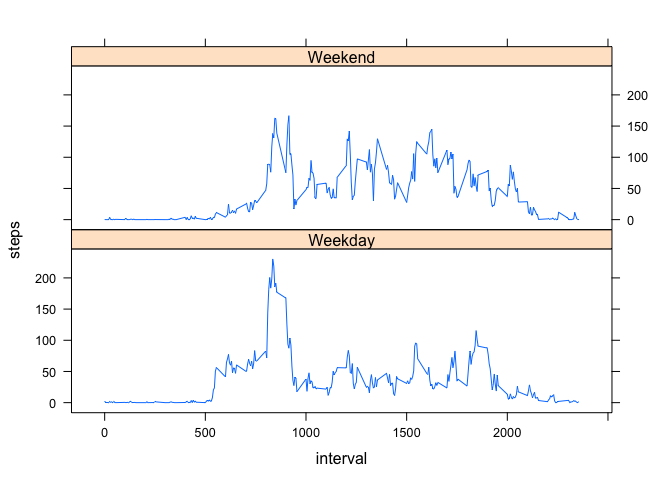

# Reproducible Research: Peer Assessment 1


## Loading and preprocessing the data


```r
echo = TRUE
act_data <- read.csv("activity.csv")
act_data$date <- as.Date(act_data$date,format="%Y-%m-%d")
```

## What is mean total number of steps taken per day?


```r
daily <- aggregate(steps ~ date,data = act_data, FUN = sum)
hist(daily$steps, xlab="total number of steps each day", main="histogram of total steps")
```

 

```r
mean(daily$steps)
```

```
## [1] 10766.19
```

```r
median(daily$steps)
```

```
## [1] 10765
```
The mean total number of steps taken per day is 1.0766189\times 10^{4}.  
The median total number of steps taken per day is 10765.

## What is the average daily activity pattern?


```r
avgsteps <- aggregate(steps ~ interval, data=act_data, FUN = mean)
plot(avgsteps$interval, avgsteps$steps, xlab="intervals", ylab="average steps", main="time series plot of average steps", type = "l")
```

 

```r
avgsteps$interval[max(avgsteps$steps)]
```

```
## [1] 1705
```
The interval 1705 contains maximum number of steps averaged on all days in the dataset.


## Imputing missing values

```r
mis_num <- sum(is.na(act_data$steps))
```
The total number of missing values in the given dataset is   

I am replacing the missing values with the mean of that particular 5 minute interval and created a new dataset.  

```r
act_data1 <- act_data
for(i in 1:nrow(act_data1))
  { if(is.na(act_data1$steps[i]))  {act_data1$steps[i] <- avgsteps$steps[avgsteps$interval == act_data1$interval[i]]}
}
```

```r
daily1 <- aggregate(steps ~ date,data = act_data1, FUN = sum)
hist(daily1$steps, xlab="total number of steps each day", main="histogram of total steps" )
```

 

```r
mean(daily1$steps)
```

```
## [1] 10766.19
```

```r
median(daily1$steps)
```

```
## [1] 10766.19
```
The mean total number of steps taken per day is 1.0766189\times 10^{4}.  
The median total number of steps taken per day is 1.0766189\times 10^{4}.  

The mean of the total number of steps taken doesn't change after replacing missing values. But the median has changed from 10765 to 1.0766189\times 10^{4}. 


## Are there differences in activity patterns between weekdays and weekends?

Here is the r code to create a new variable called day.  

```r
act_data1$day <- weekdays(act_data1$date)
act_data1$day[act_data1$day == "Saturday"] <- "Weekend"
act_data1$day[act_data1$day == "Sunday"] <- "Weekend"
act_data1$day[act_data1$day != "Weekend"] <- "Weekday"
```

R code to create a time series plot of 5 minute interval and average number of steps taken over weekends and weekdays.

```r
library(lattice)
avgsteps1 <- aggregate(steps ~ interval*day, data=act_data1, FUN = mean)
xyplot(steps ~ interval | day, avgsteps1, type="l", layout = c(1,2))
```

 

There doesn't seem to be much difference in the activity pattern between weekends and weekdays based on the time series plot. 

